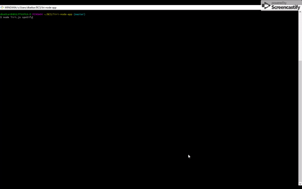
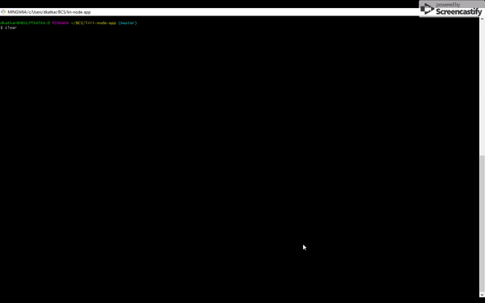

# liri-node-app
LIRI stands for Language Interpretation and Recognition Interface. It's a command line node app that takes in parameters and gives back data

## Problem Statement 
Liri app accepts one of the commands from a pre-defined set. It also accpets user input along with command. The app retrieves data relevant to user input by making a call to appropriate API based on the command. 

## App Overview

The app makes use following node modules-
* Axios

* Dotenv

* Moment

* Node-spotofy-api

The file structure of the app- 
* liri.js 

* .env

* keys.js 

## Instructions to run the app

## Screenshots

1. Concert information

2. Spotify song information

3. OMDB movie information

4. Do what it says

## Deployed version of the app
 https://github.com/dkaj1990/liri-node-app

## Technologies

